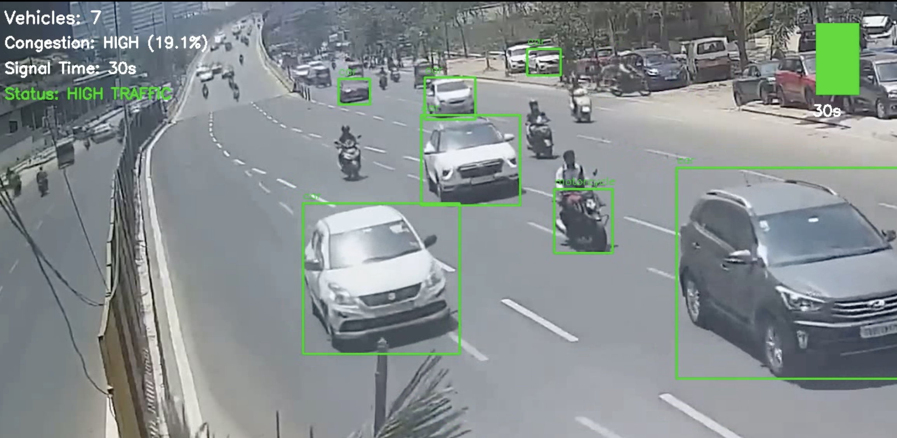

# 🚦 AIoT Adaptive Traffic Signal System

An AI-powered traffic management system that dynamically adjusts signal timing using real-time vehicle detection.gfg 

---

## 📌 Overview

Traditional traffic systems rely on fixed timers, which often lead to congestion, inefficient traffic flow, and increased waiting time.

This project leverages **Computer Vision + AIoT** to detect vehicles in real time and adapt traffic signals based on traffic density.

---

## 🎥 Demo Video (IMPORTANT)

👉 **Watch Full Working Demo:**  
🔗 https://drive.google.com/file/d/1FMBXMYgWmxljm3ESb5XbIuJrRhrQ5dTw/view?usp=share_link

>  *This video demonstrates the real-time detection and adaptive signal behavior. Highly recommended to view.*

---

## 🚨 Problem Statement

- Fixed signal timers do not adapt to real-time traffic  
- Causes unnecessary waiting and congestion  
- Leads to inefficient traffic flow and fuel wastage  
- Can result in unsafe driving behavior  

---

## 💡 Proposed Solution

- Real-time vehicle detection using **YOLOv5**
- Traffic density estimation from live/video input
- Dynamic signal timing using rule-based logic

---

## ⚙️ Working Pipeline

1. Capture input from traffic camera / video feed  
2. Apply YOLOv5 for vehicle detection  
3. Detect objects (cars, bikes, buses, etc.)  
4. Count number of vehicles in frame  
5. Calculate traffic density  
6. Adjust signal timing dynamically:
   - High density → Longer green signal  
   - Low density → Shorter green signal  

---

## 📸 Output (Detection Result)

---

## 🛠️ Tech Stack

- Python  
- YOLOv5  
- OpenCV  
- Google Colab  

---

## 📊 Results

- Improved traffic flow compared to static systems  
- Reduced unnecessary waiting time  
- Demonstrates real-world application of AI in smart cities  

---

## 📄 Research Relevance

This project aligns with comparative research on object detection models including:

- YOLOv5  
- YOLOv8  
- Faster R-CNN  
- SSD  

Focused on performance in **real-world Indian traffic conditions**

---

## 🚀 Future Scope

- Integration with live CCTV feeds  
- Reinforcement learning-based signal optimization  
- Multi-intersection coordination  
- Smart city deployment  

---

## 👨‍💻 Author

**Sharwil Bhende**

---

